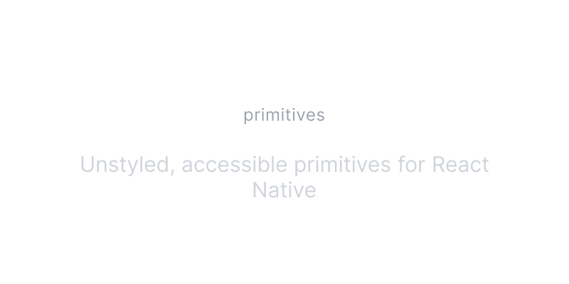

# NativeUI Primitives

A collection of unstyled, accessible UI primitives for React Native. Built with flexibility in mind, these components work seamlessly across iOS, Android, and Web.

Start here, then make it your own. Open Source. Open Code. Use this to build your own component library.

## Documentation

Visit [primitives.nativeui.io](https://primitives.nativeui.io) to view the documentation.

## Contributing

Please read the [contributing guide](./CONTRIBUTING.md).

## License

Licensed under the [MIT license](./LICENSE).
